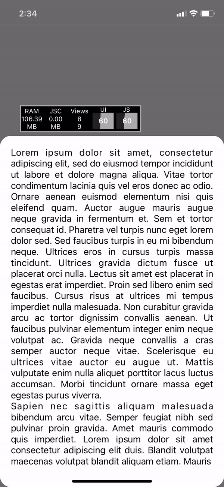

# react-native-drawer-bottom

Gesture based Bottom Drawer @60FPS.

<!--  -->


## Installation

```sh
npm install react-native-drawer-bottom
```

## Usage

```js
import DrawerBottom from 'react-native-drawer-bottom';

// ...

<DrawerBottom
  backgroundColor={'red'}
  topInset={10}
  bottomInset={200}
  borderRadius={10}
  animationDelay={600}
>
  //...
</DrawerBottom>;
```

### Props

| Prop              | Type   | Description                       |
| ----------------- | ------ | --------------------------------- |
| `topInset`        | number | Visible area start point from top |
| `bottomInset`     | number | Visible area bottom               |
| `borderRadius`    | number | Top corner radius                 |
| `backgroundColor` | string | Background Color of the root      |
| `animationDelay`  | number | Delay in ms. SHOW and HIDE Sheet. |

## Example

- `yarn example start`: start the Metro server for the example app.
- `yarn example android`: run the example app on Android.
- `yarn example ios`: run the example app on iOS.

### Note

Suitable without ScrollView. HOC ScrollView support coming soon.

## Contributing

See the [contributing guide](CONTRIBUTING.md) to learn how to contribute to the repository and the development workflow.

## License

MIT
